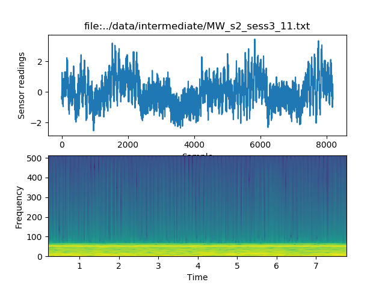
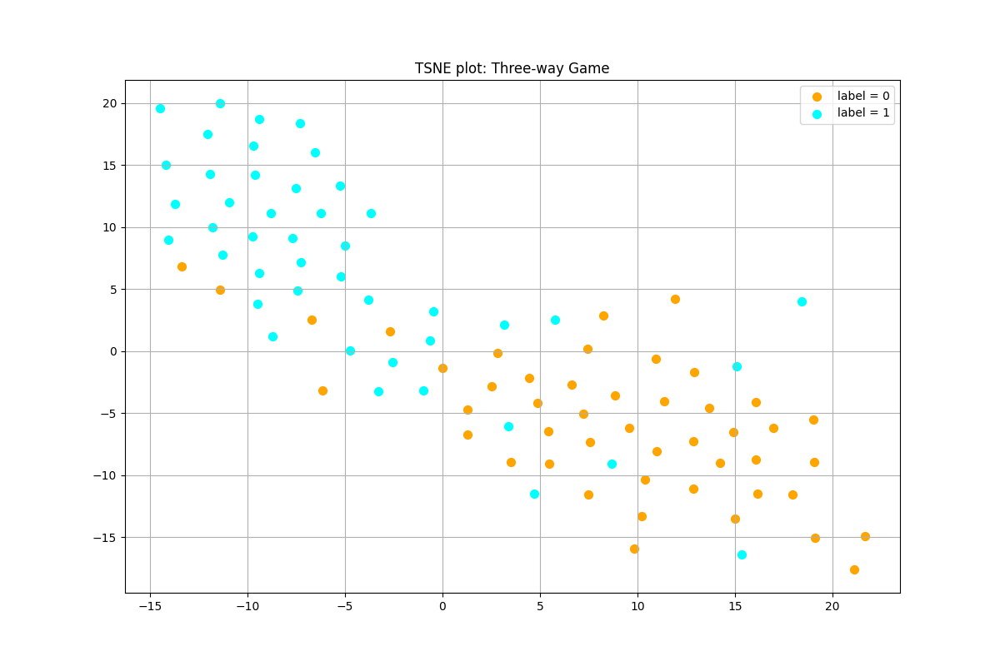

# Conditional Adversarial Architecture -- Tensorflow 2.0 version

## Part 1: Binary classification using a CNN

I have converted every raw sensor recording into a two-dimensional spectrogram. To avoid regenerate the 2d representations of original data every time, I set 'recalculate = False' and the code will only generate representations files only once. I split the data into train/validation/test datasets with fraction of 80%, 10%, 10% respectively. The datasets are well balanced in terms of the number of samples with label=0 (F) and label = 1 (MW) and the number of samples from subjects 1 and 2: 
| datasets | samples with lables=0 (F) | samples with lables=1 (MW) | subject 1 samples | subject 2 samples |
|-----------|:-------------------------:|:--------------------------:|:-------------------:|:------------------:|
| training | 377 | 245 | 420 | 302 |
| validation | 44 | 46 | 51 | 39|
|test | 47 | 44 | 57 | 34 |

 Similar to [Zhao etc.'s paper](http://sleep.csail.mit.edu), I adopt an encoder network is composed of 16 convolutional layers with residual blocks. The size of input data for the network is (224,224, 1). Since there are only several hundred samples, I reduced the number of layers and the number of filters to avoid overfitting. The predictor has two fully connected (FC) networks. 

Train the CNN model in the command line: `python train.py -p data/ --train true`
Load pre-train model and run prediction: `python train.py --checkpoint "check_point-CNN"`

The performance of the CNN model (averaged by 10 runs):
| datasets | Accuracy (sd) | 
|-----------|:-------------------------:|
| training | 98.2% (3.6%) | 
| validation | 79.8% (1.6%) |
|test | 79.7% (3.2%) | 

 The accuracy of the training set is much higher than the validation set and the test set. Including more data through data augmentation or reducing the size of the model can potentially improve the performance because the model is overfitting. However, overfitting can also relate to noise in the data. In this case, because the raw data is collected from two subjects in different environments. The background noise might mistakenly be recognized as patterns for the CNN. Remove those subject-dependent noises in the data will help us to build a better subject-independent solution. 

## Part 2: Three-Way Game

Zhao's paper points out that if we use a discriminator, in theory, it will discard extraneous information about the source (in this case is the subject's id) when the three players' game at equilibrium. Each subject's background noise will be removed by the adversarial training process. More details about this three-way game can be in the paper. Since the output of the predictor plays as an underlying posterior, we should avoid the gradient backpropagation from the discriminator to the predictor. 

Train the three-way game model in the command line: `python train.py --train true --game true`
Load pre-train model and run prediction: `python train.py --checkpoint "check_point-CAA"`

The performance of the three-way game model (averaged by 5 runs): 
| datasets | Accuracy (sd) | 
|-----------|:-------------------------:|
| training | 88.4% (2.5%) | 
| validation | 83.3% (1.8%) |
|test | 85.5% (1.4%) | 

The performance of this model on the test dataset is better than the CNN model because the discriminator helps to remove subject-dependent information in the feature maps. To prove that scenario, I plotted the TSNE of the feature map at the last layer of the encoder. 

 

The three-way game model generates a better feature map, where the majority of samples of class=0 or 1 forms a cluster and no matter the data from subject 1 or 2. It also worth to mention that the majority data of the CNN model also clustering in the TSNE plot, but it could be due to the limited amount of data. All the conclusion make in this study, need to confirm with large size of data. 

## Requirement

The list of required packages can be found in `requirements/requirements.txt`. There are different ways to get the required package:
 - Run `pip install ` to get the package. 
 - if use `conda`, run `conda env create -f environment.yaml` in the command line and it will create a new environment named `CAA`, and then run `coda activate CAA` to activate the new environment.
 
 When run the code, copy `file_locator.csv` and `intermediate` folder to `data` in this repo.